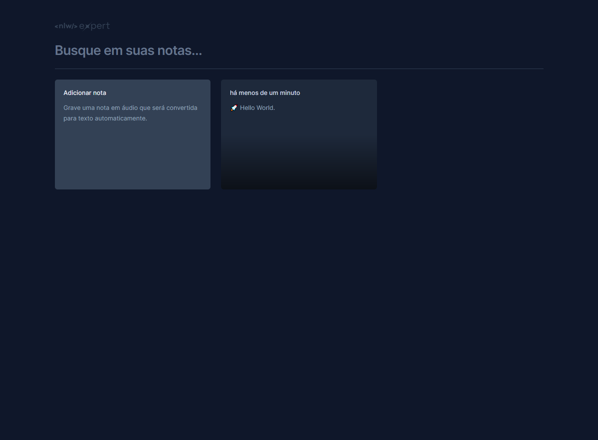

# Expert Notes

## Sobre

Aplicativo em React elaborado durante o evento NLW Expert (2024).

O aplicativo oferece um quadro de anotações interativo, permitindo aos usuários adicionar e excluir notas facilmente. Além disso, o aplicativo possibilita a gravação de anotações por áudio que posteriormente são convertidas em texto, ou inserção direta de texto.

O projeto foi elaborado em React e Tailwind e para a função de reconhecimento de fala foi utilizado a biblioteca [SpeechRecognition](https://developer.mozilla.org/en-US/docs/Web/API/SpeechRecognition).

## Instalação

Dependência: Node 18.17.0

Para rodar a aplicação basta:

1. Instalar as dependências `npm install`
2. Rodar o comando `npm run dev` ou `npx vite`
